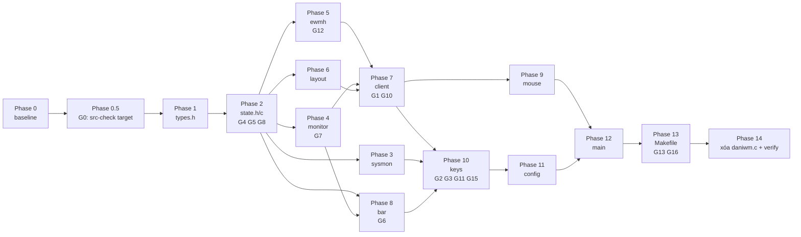

# PLAN — Xử lý gaps khi tách module `daniwm.c`

Tài liệu này giải quyết các điểm mơ hồ/xung đột giữa [`refactor_plan.md`](refactor_plan.md) và thực tế code (đã verify caller bằng `grep` trên `daniwm.c` 2619 dòng).

Kết quả review: **G7, G10 không phải gap** (đã sửa lại trong `TASKS.md`); có thêm **G11–G16** là gap thật, trong đó **G0 (build verification) nghiêm trọng nhất**.

---

## 1. Phân loại gaps (sau khi verify)

| ID | Loại | Nội dung | Ảnh hưởng | Phase |
|---|---|---|---|---|
| **G0** | 🔴 Gap thật (nặng) | Makefile chỉ trỏ `daniwm.c` tới Phase 13 → mọi bước "make sau mỗi phase" **không compile code mới** | Toàn bộ kế hoạch verify từng bước bị vô hiệu | 0.5 |
| G1 | 🟡 Plan bỏ sót | `matchrules` (1389) không được gán module | Thấp — chỉ `manage` gọi → giữ `static` trong `client.c` | 7 |
| G2 | 🟡 Plan bỏ sót | `findscratch` (1408) không được gán module | Thấp — chỉ `k_scratch` gọi → `static` trong `keys.c` | 10 |
| G3 | 🔴 Plan tự mâu thuẫn | `keys/nkeys/capkeys/push_key_fn/add_default_keys` vừa ở `keys.h` (Module 10) vừa ở `config.c` (Module 11, dòng 1831) | Cao — 2 owner, dễ double-define hoặc lệch prototype | 10–11 |
| G4 | 🔴 Gap thật | `S()` (49) + `ui_scale` (47) dùng ở **mọi module** | Cao — nếu chỉ khai báo prototype sẽ thiếu symbol | 2 |
| G5 | 🟡 Plan bỏ sót | `LAYOUT/MFACT/NMASTER` (153–155) | Trung bình — 4 module dùng | 2 |
| G6 | 🟡 Plan ghi sai vị trí | `bar_style` ở **2267**, `scaled_font_pat` ở **2246** (plan ghi trong dải 561–798) | Trung bình — `bar_style` có 3 caller ngoài `bar.c` | 8 |
| G7 | ✅ Không phải gap | `screen_extents` (1220) tuy nằm vùng EWMH nhưng plan **đã** gán cho `monitor.c` (Module 3, dòng 1218–1233) | Thấp — chỉ cần `ewmh.c` include `monitor.h` | 4 |
| G8 | 🟡 Plan bỏ sót | `MAXWS/MAXMONS/FLOAT_STEP/RSZ_STEP` rải rác (57, 102, 1689–1690) | Thấp | 2 |
| G9 | 🔴 Gap thật | Mọi hàm là `static`; tách module bắt buộc gỡ `static` ở hàm public nhưng **giữ** ở helper | Cao — gỡ nhầm → trùng symbol; giữ nhầm → linker undefined | 3–12 |
| G10 | ✅ Không phải gap | `last_kill_win`/`last_kill_time` (942–943) chỉ dùng trong `kill_sel` | Không — giữ `static` trong `client.c`, **không** cần `state.h` | 7 |
| **G11** | 🔴 Mâu thuẫn | `add_default_keys` (1831) duyệt `k_*`, `view`, `send_to`, `MOD`, `NWS` → phải ở `keys.c`, không phải `config.c` | Cao | 10–11 |
| **G12** | 🟡 Plan thiếu | `get_strut` (1180) chỉ ewmh dùng → **giữ `static`**, plan đúng khi không liệt kê ở `ewmh.h` | Thấp | 5 |
| **G13** | 🔴 Gap vận hành | `.gitignore` chỉ có `daniwm`, `test/dock-helper`; thiếu `src/*.o`, `src/*.d` | Trung bình — `git status` bẩn, dễ commit nhầm object | 13 |
| **G14** | 🟡 Rủi ro | `-Wshadow` bật sẵn; khi `state.h` được include khắp nơi, biến local trùng tên global (vd `sel`, `keys`, `bar`) có thể phát warning | Trung bình | 3–12 |
| **G15** | 🟡 Rủi ro | Header cycle tiềm ẩn `keys.h ↔ config.h` (`actions[]` cần `k_reload`, `config.c` cần `push_key_fn`) | Trung bình | 10 |
| **G16** | 🟡 Gap vận hành | `test/*.sh` gọi `$TDIR/../daniwm` → binary **phải** ở repo root, không được để `src/daniwm` | Cao nếu sai | 13 |
| **G17** | 🔴 Gap thật (phát hiện khi tách, Phase 11) | `parse_bind` dùng `sizeof(actions)/sizeof(actions[0])` trong khi `actions[]` giờ là `extern` (incomplete type) | `nactions` export từ `keys.c` (giữ `actions[]` nguyên byte) | 10–11 |

---

## 2. G0 — Sửa lỗ hổng build verification (làm TRƯỚC mọi phase)

### Vấn đề
`Makefile` hiện tại:
```makefile
daniwm: daniwm.c
	$(CC) $(CFLAGS) -o $@ $< $(LDFLAGS)
```
Từ Phase 3–12, `make` vẫn chỉ biên dịch `daniwm.c`. Các file `src/*.c` mới **không bao giờ được compile** → không phát hiện lỗi type, prototype, `static` cho tới Phase 13. Kế hoạch "make sau mỗi bước" trong `refactor_plan.md` là **sai**.

### Giải pháp: thêm target tạm `src-check`
Ở **Phase 0.5**, thêm vào Makefile (giữ nguyên target `daniwm`):

```makefile
# TEMP (bỏ ở Phase 13): compile mọi src/*.c, không link, để verify từng phase.
SRC_ALL := $(wildcard src/*.c)
src-check: $(SRC_ALL:.c=.o)
	@echo "src-check: OK ($(words $(SRC_ALL)) files)"

src/%.o: src/%.c
	$(CC) $(CFLAGS) -c -o $@ $<
```
Sau **mỗi phase**: `make src-check` (bắt lỗi syntax/type/prototype) + `make` (đảm bảo binary cũ vẫn build) + `make check` cuối mỗi 2–3 phase.

Ở **Phase 13**, thay phần TEMP bằng `SRCS`/`OBJS` chính thức như plan.

### Vì sao không đổi Makefile sang đa file ngay từ đầu
Vì `src/main.c` chưa tồn tại và `daniwm.c` vẫn là entry point. Build song song sẽ tạo 2 `main()` → lỗi linker. `src-check` compile-only là cách duy nhất verify sớm mà không phá build hiện tại.

---

## 3. Ownership matrix (sau khi verify caller)

> `static` = chỉ dùng trong file đó, **không** export header. Đây là danh sách chống lệch.

| Symbol | Module | Visibility | Header | Caller ngoài module |
|---|---|---|---|---|
| `S`, `ui_scale`, `MAXWS/MAXMONS/FLOAT_STEP/RSZ_STEP`, `LAYOUT/MFACT/NMASTER` | `state.h` | `static inline` / `extern` / `#define` | `state.h` | tất cả |
| `bar_style` | `bar.c` | **public** | `bar.h` | `monitor.c:291`, `config.c:2224`, `main.c:2365` |
| `scaled_font_pat` | `bar.c` | `static` | — | chỉ `bar_style` |
| `bar_text`, `bar_textw`, `bar_runs`, `bar_glyph_font`, `utf8_decode`, `utf8_fit_len`, `get_title`, `xft_alloc` | `bar.c` | `static` | — | không (plan ghi public → **siết lại**, xem G6) |
| `drawbar` | `bar.c` | **public** | `bar.h` | `layout.c:428`, `client.c:818/863/910/1535`, `ewmh.c:1068`, `keys.c:1433`, `config.c:2317`, `main.c:2422/2555/2562` |
| `matchrules` | `client.c` | `static` | — | chỉ `manage` (G1) |
| `last_kill_win`, `last_kill_time` | `client.c` | `static` | — | chỉ `kill_sel` (G10) |
| `findscratch` | `keys.c` | `static` | — | chỉ `k_scratch` (G2) |
| `get_strut` | `ewmh.c` | `static` | — | chỉ `update_struts`/`manage_dock`/`update_dock_strut` (G12) |
| `screen_extents` | `monitor.c` | **public** | `monitor.h` | `ewmh.c:1201/1252` (theo plan, G7) |
| `keep_docks_on_top` | `client.c` | **public** | `client.h` | `mouse.c:1602`, `keys.c:1699` |
| `first_in_ws` | `client.c` | **public** | `client.h` | `keys.c:1430`, `config.c:2214` |
| `focus_step` | `client.c` | **public** | `client.h` | `keys.c:1648/1649` |
| `move_to` | `client.c` | **public** | `client.h` | `main.c:2475` |
| `ewmh_read_desktop` | `ewmh.c` | **public** | `ewmh.h` | `client.c:1465` |
| `find_dock` | `ewmh.c` | **public** | `ewmh.h` | `ewmh.c` nội bộ + plan yêu cầu |
| `push_key_fn`, `add_default_keys`, `keys_reset`, `grabkeys`, `k_reload` | `keys.c` | **public** | `keys.h` | `config.c` (G3/G11/G15) |
| `actions`, `nactions` | `keys.c` | **public** | `keys.h` | `config.c:parse_bind` (G17) |
| `keys`, `nkeys`, `k_vol_up`, `k_vol_down`, `k_vol_mute` | `keys.c` | **public** | `keys.h` | `main.c` event loop (KeyPress dispatch + scroll) — khớp baseline, `capkeys` vẫn `static` |
| `keys`, `nkeys`, `capkeys` | `keys.c` | `static` | — | **không** cần `state.h` (sửa T2.1) |
| `A_NET_*` atoms | `state.c` | `extern` | `state.h` | `ewmh.c`, `client.c:1481/1482`, `main.c:2462–2543` |
| `float_promote`, `float_moveby`, `float_rszby` | `keys.c` | `static` | — | chỉ `k_move_*`/`k_rsz_*` |
| `vol_try_amixer/wpctl/pactl` | `sysmon.c` | `static` | — | chỉ `sys_vol` |
| `xerror_other_wm`, `xerror_ignore` | `main.c` | `static` | — | chỉ `main` |

**Nguyên tắc**: mặc định `static`. Chỉ export khi có caller ở module khác (cột cuối cùng không rỗng). Điều này đi ngược thói quen "cứ cho vào header" và là chìa khoá để G9 an toàn.

---

## 4. Resolution chi tiết

### G0 — Build verification
Xem §2. Task mới **T0.6**: thêm target TEMP `src-check`, commit riêng.

### G1 — `matchrules` → `client.c`, giữ `static`
- Chuyển 1389–1406 vào `client.c`, **giữ `static`**.
- Cần `rules`, `nrules`, `NWS` (đã có ở `state.h`).
- Không thêm gì vào `client.h`.

### G2 — `findscratch` + `k_scratch` → `keys.c`
- `findscratch` 1408–1418 + `k_scratch` 1420–1448 cùng vào `keys.c`; `findscratch` giữ `static`.
- `keys.c` include: `ewmh.h` (`ewmh_set_wm_desktop`), `client.h` (`first_in_ws`, `focus`, `spawn`), `monitor.h` (`getarea`, `mon_by_pointer`), `layout.h` (`arrange`), `bar.h` (`drawbar`).

### G3 + G11 — Ownership bảng phím
**Quyết định**: toàn bộ key table thuộc `keys.c`.
- Chuyển **`add_default_keys` (1831–1872)** và **`push_key_fn` (1766–1774)** từ `config.c` sang `keys.c`.
- `keys.c` giữ `static Key *keys; static unsigned nkeys, capkeys;`
- `keys.h` export:
  ```c
  #pragma once
  #include "state.h"
  void grabkeys(void);
  void add_default_keys(void);
  void keys_reset(void);   /* NEW: thay cho nkeys = 0 trực tiếp */
  void push_key_fn(KeySym ks, unsigned int mod, void (*fn)(int), int arg);
  void k_reload(int);      /* impl ở config.c, xem G15 */
  ```
- `config.c`:
  - `config_defaults()`: `keys_reset(); add_default_keys();` (thay dòng 1876)
  - `load_config()`: `if (!saw_bind) { keys_reset(); saw_bind = 1; }` (2155)
  - `load_config()`: `if (!saw_bind) { keys_reset(); add_default_keys(); }` (2169)
  - `parse_bind()`: gọi `push_key_fn(...)` (2078) — đã public.
- `keys_reset()` impl: `nkeys = 0;` (không free mảng — giữ hành vi cũ, chỉ reset count).

### G4 — `S()` + `ui_scale` ở `state.h`
```c
/* state.h */
extern float ui_scale;

static inline int S(int v) {
    if (v <= 0) return 0;
    return (int)((float)v * ui_scale + 0.5f);
}
```
- `state.c` chỉ `float ui_scale = 1.0f;`
- ⚠️ Bắt buộc `static inline` (không phải prototype) — nếu chỉ khai báo, linker thiếu symbol ở ~10 module.
- ⚠️ `state.h` include `<Xft/Xft.h>`? Không — `S()` không cần Xft; `types.h` mới cần. Giữ `state.h` nhẹ.

### G5 — Macro layout ở `state.h`
```c
#define LAYOUT  (ws_layout[curws])
#define MFACT   (ws_mfact[curws])
#define NMASTER (ws_nmaster[curws])
```
- Đặt **sau** các `extern ws_layout/ws_mfact/ws_nmaster/curws`.
- Dùng ở `layout.c`, `bar.c`, `mouse.c`, `keys.c` (đúng như hiện tại).

### G6 — `bar_style` / `scaled_font_pat`
- Chuyển **2267–2317** (`bar_style`) và **2246–2265** (`scaled_font_pat`) về `bar.c`.
- `bar_style` → public (`bar.h`); `scaled_font_pat` → `static`.
- **Siết `bar.h` lại** so với plan: chỉ export `bar_style`, `drawbar`. Các hàm `bar_text/bar_textw/bar_runs/utf8_*/get_title/xft_alloc/bar_glyph_font` **giữ `static`** vì không có caller ngoài `bar.c`. → ít symbol toàn cục hơn, giảm rủi ro G9.

### G7 — `screen_extents` → `monitor.c` (theo plan, không phải gap)
- Chuyển 1220–1233 sang `monitor.c`, export ở `monitor.h`.
- `ewmh.c` thêm `#include "monitor.h"`.
- Không đổi logic. `screen_extents` dùng `nmons`, `mons`, `sw`, `sh` (state.h).

### G8 — Hằng số về `state.h`
`MAXWS 10`, `MAXMONS 16`, `FLOAT_STEP 20`, `RSZ_STEP 20` → `state.h` (không để trong `.c` vì nhiều module dùng; `MAXMONS` còn dùng cho mảng stack trong `on_monitors_changed` và `ewmh_desktops`).

### G9 — Chính sách `static`
1. **Public** = có caller khác module (theo matrix §3). Gỡ `static`, thêm prototype vào header.
2. **Helper** = giữ `static`. **Không** gỡ chỉ vì "chuyển file".
3. Verify bằng compiler (xem §6): dùng `-Wmissing-prototypes` tạm thời để bắt hàm public thiếu prototype, và `nm -g` để so symbol.

### G10 — `last_kill_win` / `last_kill_time`
- Chỉ `kill_sel` dùng → **giữ `static` trong `client.c`**, **không** đưa vào `state.h` (sửa lại T2.1 và G10 cũ).

### G12 — `get_strut`
- Giữ `static` trong `ewmh.c` (chỉ ewmh dùng). Plan đúng khi không liệt kê ở `ewmh.h`. Sửa T5.1 (đã ghi nhầm là "plan thiếu").

### G13 — `.gitignore`
```gitignore
daniwm
test/dock-helper
test/shots/
src/*.o
src/*.d
```

### G14 — `-Wshadow`
- Sau khi include `state.h` khắp nơi, nếu xuất hiện warning `declaration shadows a global declaration`:
  - **Đổi tên biến local** (behavior-neutral), **không** đổi tên global và **không** tắt `-Wshadow`.
  - Ứng viên cần soi: local tên `sel`, `keys`, `bar`, `dpy`, `screen`, `client`.
- Ghi lại mọi rename vào commit message để review.

### G15 — Tránh header cycle `keys.h ↔ config.h`
- `k_reload` **khai báo trong `keys.h`**, **định nghĩa trong `config.c`**.
- `keys.h` **không** include `config.h`.
- `config.c` include `keys.h` (để gọi `push_key_fn`, `add_default_keys`, `keys_reset`, và implement `k_reload`).
- `keys.c` **không** include `config.h`.
- → đồ thị include một chiều: `config.c → keys.h`, `keys.c → keys.h`. Không cycle.

### G16 — Binary ở repo root

- Makefile: `daniwm: $(OBJS)` với `$(CC) -o daniwm ...` (output root), object nằm `src/*.o`.
- `test/run-all.sh` và 7 script test giữ nguyên `$TDIR/../daniwm`.

### G17 — `sizeof()` trên mảng cross-module (phát hiện ở Phase 11, đã duyệt qua supervisor)

- Gốc: `parse_bind` duyệt `for (i = 0; i < sizeof(actions)/sizeof(actions[0]); i++)` (`daniwm.c:2019`).
- Sau khi tách, `actions[]` chỉ còn `extern const KeyAction actions[];` trong `keys.h` → incomplete type, `sizeof` không compile.
- Fix đã duyệt: `extern const unsigned nactions;` trong `keys.h`, define ngay sau mảng trong `keys.c`:
  `const unsigned nactions = sizeof(actions) / sizeof(actions[0]);`, vòng lặp dùng `nactions`.
- Bác bỏ sentinel `{ NULL, NULL }`: sửa mảng + sửa vòng lặp = deviation lớn hơn.
- Quy tắc chung: mọi `sizeof(x)/sizeof(x[0])` trên symbol đã chuyển ra khỏi file → áp cùng pattern.
- Makefile: `daniwm: $(OBJS)` với `$(CC) -o daniwm ...` (output root), object nằm `src/*.o`.
- `test/run-all.sh` và 7 script test giữ nguyên `$TDIR/../daniwm`.

---

## 5. Thứ tự thực hiện điều chỉnh



**Điểm phụ thuộc quan trọng**: `monitor.c` (Phase 4) gọi `bar_style()` → cần `bar.h` tồn tại. Vì `src-check` chỉ compile từng file, `bar.h` phải được tạo ở **Phase 1.5** (khai báo trước, impl sau) hoặc chấp nhận Phase 4 chưa `src-check` được tới khi Phase 8 xong. Chọn: **tạo trước toàn bộ header skeleton ở Phase 1.5** (types.h + tất cả header rỗng có `#pragma once` + prototype), rồi mới đổ impl dần. Điều này cũng cố định hợp đồng API sớm, tránh sửa header nhiều lần.

→ **Task mới T1.4**: tạo skeleton tất cả `.h` với prototype cuối cùng (theo matrix §3) + `#pragma once`.

---

## 6. Mitigation flags & lệnh verify

```bash
# Flags tạm để bắt lỗi ownership (chạy ở Phase 2, 7, 10, 11)
make clean
make CFLAGS="-O2 -Wall -Wextra -Wpedantic -Wshadow -Wmissing-prototypes -Wmissing-declarations -Wredundant-decls" src-check

# So symbol toàn cục: baseline vs sau refactor
nm -g --defined-only /tmp/daniwm.baseline | awk '{print $3}' | sort > /tmp/sym.before
nm -g --defined-only daniwm            | awk '{print $3}' | sort > /tmp/sym.after
diff /tmp/sym.before /tmp/sym.after    # chỉ được khác các symbol static (không xuất hiện ở before)

# Bắt buộc: static phải biến mất khỏi bảng symbol toàn cục
# (baseline có nhiều static symbol; after chỉ còn hàm public + globals state.c)
```

**Cảnh báo**: `-Wmissing-prototypes` sẽ báo tất cả hàm public chưa có prototype → đúng mục đích. Nhưng cũng báo hàm `static` không cần prototype? Không — chỉ báo hàm **non-static** thiếu prototype. Dùng để chốt danh sách export.

---

## 7. Checklist thực thi gaps

- [x] **G0** — T0.6: thêm target TEMP `src-check` vào Makefile, commit riêng trước Phase 1.
- [x] **G0/T1.4** — tạo skeleton toàn bộ `.h` (prototype theo matrix §3) ở Phase 1.5.
- [x] **G4/G5/G8** — `state.h` có `S()` `static inline`, 3 macro layout, 4 hằng số; `ui_scale` extern.
- [x] **G7** — `screen_extents` trong `monitor.c`; `ewmh.c` include `monitor.h`.
- [x] **G12** — `get_strut` giữ `static` trong `ewmh.c`.
- [x] **G1** — `matchrules` vào `client.c`, giữ `static`.
- [x] **G10** — `last_kill_win/time` giữ `static` trong `client.c`, không vào `state.h`.
- [x] **G6** — `bar_style` public, `scaled_font_pat` + `bar_text*` + `utf8_*` + `get_title` + `xft_alloc` giữ `static`.
- [x] **G2** — `findscratch` (static) + `k_scratch` vào `keys.c`.
- [x] **G3/G11** — `keys/nkeys/capkeys` static trong `keys.c`; `push_key_fn`, `add_default_keys`, `keys_reset`, `grabkeys`, `k_reload` export ở `keys.h`.
- [x] **G15** — `keys.h` không include `config.h`; `k_reload` khai báo ở `keys.h`, impl ở `config.c`.
- [x] **G14** — 0 warning `-Wshadow` sau mỗi phase; rename local nếu cần.
- [x] **G13** — `.gitignore` thêm `src/*.o`, `src/*.d`.
- [x] **G16** — binary `daniwm` ở repo root, `src/*.o` cho object.
- [x] **G17** — `nactions` export ở `keys.h`, define ở `keys.c`, `parse_bind` dùng `nactions`.
- [x] **G9** — `make ... -Wmissing-prototypes src-check` sạch; `nm -g` diff đúng kỳ vọng.

## 8. Sửa lại `TASKS.md` cho khớp

Các mục sau trong `TASKS.md` đã được cập nhật:
- **T2.1**: bỏ `keys/nkeys/capkeys` và `last_kill_win` khỏi danh sách `extern` (chúng ở lại `keys.c` / `client.c` dạng `static`).
- **T5.1**: bỏ `get_strut` khỏi header (giữ `static`); giữ `find_dock`, `ewmh_read_desktop`.
- **Bảng gaps**: G7 và G10 chuyển thành "không phải gap"; thêm G0, G11–G16.
