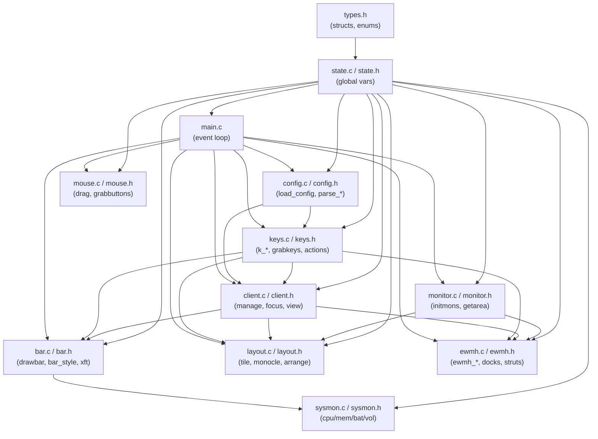
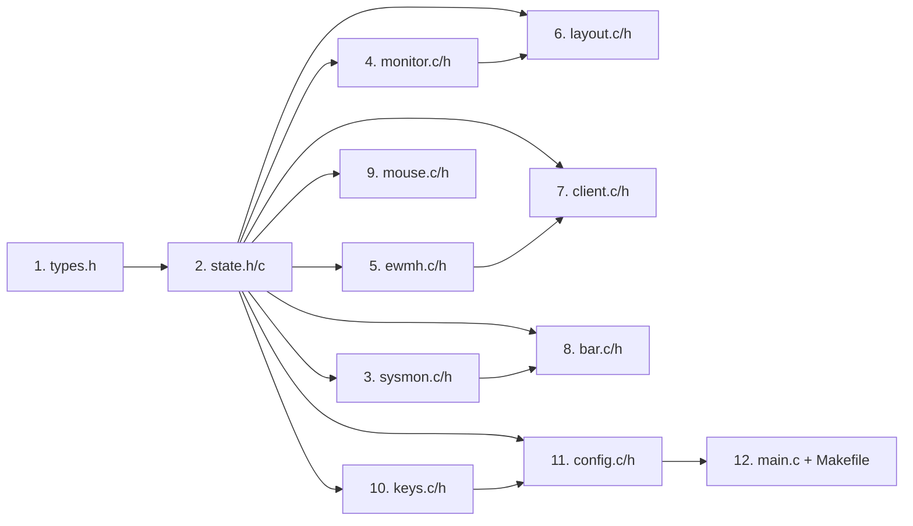

# Kế hoạch tách module daniwm.c

## Mục tiêu

`daniwm.c` hiện tại có **2620 dòng (~106 KB)** trong một file duy nhất. Mục tiêu là tách thành **11 module** rõ ràng, giữ nguyên 100% logic và behavior, chỉ tổ chức lại cấu trúc code để dễ đọc, bảo trì và mở rộng.

> [!IMPORTANT]
> Đây là **refactor thuần túy** — không thay đổi behavior, không thêm feature. Binary sau khi tách phải pass toàn bộ test hiện có.

---

## User Review Required

> [!WARNING]
> **Biến global**: Code hiện tại dùng rất nhiều biến global (`dpy`, `root`, `clients`, `sel`, v.v.). Khi tách module, tất cả biến này sẽ được khai báo `extern` trong `state.h` và định nghĩa trong `state.c`. Đây là cách tiếp cận bảo thủ nhất để giảm rủi ro lỗi.

> [!IMPORTANT]
> **Header include guards**: Mỗi `.h` file sẽ có `#pragma once` hoặc `#ifndef` guard để tránh double-include.

> [!NOTE]
> **Không đổi tên hàm/struct**: Tất cả tên hàm, struct, typedef giữ nguyên để diff dễ đọc và git blame vẫn có ích.

---

## Open Questions

> [!IMPORTANT]
> **Bạn có muốn giữ `daniwm.c` gốc** dưới dạng backup (ví dụ `daniwm.c.bak`) trong khi refactor? Hay dùng git để rollback?

> [!NOTE]
> **Thư mục `src/`**: Có nên đặt tất cả `.c/.h` vào thư mục `src/` riêng để gọn không? Hay để tất cả ở root như hiện tại?

---

## Proposed Changes

### Dependency Graph



---

### Module 1: `types.h` — Structs & Enums

#### [NEW] types.h

Chứa tất cả typedef/struct/enum dùng chung. Không có code thực thi.

```c
#pragma once
#include <X11/Xlib.h>
// ... other X11 includes

typedef struct Client Client;
struct Client {
    Window win;
    int ws, floating, fullscreen, hidden, urgent, mon;
    int fx, fy, fw, fh;
    float cfact;
    Client *next;
};

typedef enum { L_TILE = 0, L_MONOCLE = 1 } Layout;

typedef struct { char *cls; char *title; int floating; int ws; } Rule;

typedef struct { int left, right, top, bottom; } StrutMargin;

typedef struct Dock Dock;
struct Dock {
    Window win;
    int has_strut;
    unsigned long strut[12];
    Dock *next;
};

typedef struct { KeySym keysym; unsigned int mod; void (*fn)(int); int arg; } Key;

typedef struct { XftColor bg, ws_act, ws_acttx, ws_occ, ws_emp, mode, title, sys; } BarColors;

typedef struct {
    Window win; int mode; int px, py, x, y, w, h, promoted, tiled0, mon0;
    float mfact0, cfact0;
} Drag;
```

**Dòng gốc**: 61–86, 114–123, 1514, 86–88 (BarColors), 1641 (Key)

---

### Module 2: `state.h` / `state.c` — Global State

#### [NEW] state.h

Khai báo `extern` cho tất cả biến global. Mỗi module `#include "state.h"` thay vì định nghĩa lại.

```c
#pragma once
#include "types.h"

#define MAXWS 10
#define MAXMONS 16

extern Display *dpy;
extern Window root, bar, checkwin;
extern int screen, sw, sh;
extern Client *clients, *sel;
extern Client **ws_sel;
extern int curws, NWS, nws_alloc;
extern Layout *ws_layout;
extern float *ws_mfact;
extern int *ws_nmaster;

/* bar */
extern Pixmap barpm;
extern GC bargc;
extern XftFont *barfont;
extern XftDraw *barxd;
extern BarColors barcol;
extern int barcol_ok, barw, bar_on;

/* monitors */
extern struct { int x, y, w, h; } mons[MAXMONS];
extern int nmons;
extern StrutMargin mon_struts[MAXMONS];
extern Dock *docks;

/* config */
extern Rule *rules;
extern unsigned nrules, caprules;
extern char **termcmd, **menucmd, **scratchcmd;
extern unsigned int MOD;
extern int BORDER;
extern unsigned long BORDER_FOCUS, BORDER_NORMAL;
extern unsigned long BAR_BG, BAR_FG, BAR_ACC, BAR_DIM;
// ... tất cả biến config khác

/* drag */
extern Drag drag;
extern Cursor cur_move, cur_resize, cur_hsplit;

/* EWMH atoms */
extern Atom A_NET_SUPPORTED, A_NET_CLIENT_LIST, /* ... */;

/* RandR */
extern int rr_event_base, rr_error_base, rr_present;
```

#### [NEW] state.c

Định nghĩa (khởi tạo) tất cả biến global:

```c
#include "state.h"

Display *dpy = NULL;
Window root = None, bar = None, checkwin = None;
// ... tất cả biến global với giá trị mặc định
```

**Dòng gốc**: 28–156

---

### Module 3: `monitor.c` / `monitor.h`

#### [NEW] monitor.h

```c
#pragma once
#include "state.h"

void initmons(void);
int  mon_at(int x, int y);
int  mon_by_pointer(void);
void getarea(int m, int *ax, int *ay, int *aw, int *ah);
void on_monitors_changed(void);
void screen_extents(long *x0, long *y0, long *x1, long *y1);
```

#### [NEW] monitor.c

**Dòng gốc**: 210–294, 1218–1233

---

### Module 4: `sysmon.c` / `sysmon.h`

Module độc lập nhất, không cần X11.

#### [NEW] sysmon.h

```c
#pragma once
int sys_cpu(void);
int sys_mem(void);
int sys_bat(char *chg, size_t n);
const char *sys_vol(void);
void sys_vol_update(void);
char **vol_set_cmd(char **am, char **wp, char **pa);
```

#### [NEW] sysmon.c

**Dòng gốc**: 431–560

---

### Module 5: `bar.c` / `bar.h`

#### [NEW] bar.h

```c
#pragma once
#include "state.h"

void bar_style(void);
void drawbar(void);
void bar_text(XftColor *c, int x, int y, const char *s);
int  bar_textw(const char *s);
```

#### [NEW] bar.c

**Dòng gốc**: 561–798

Cần include `sysmon.h` (dùng `sys_vol`, `sys_cpu`, `sys_mem`, `sys_bat`).

---

### Module 6: `ewmh.c` / `ewmh.h`

#### [NEW] ewmh.h

```c
#pragma once
#include "state.h"

void ewmh_init(void);
void ewmh_client_list(void);
void ewmh_active(void);
void ewmh_desktops(void);
void ewmh_set_wm_desktop(Client *c);
void ewmh_update_state(Client *c);
void setfullscreen(Client *c, int fs);
int  ewmh_isdock(Window w);
int  ewmh_isfloating_type(Window w);
int  ewmh_hasstate(Window w, Atom state);
int  ewmh_read_desktop(Window w);
void set_urgent(Client *c, int urg);
int  ws_has_urgent(int n);
void update_struts(void);
void manage_dock(Window w);
void unmanage_dock(Window w);
void update_dock_strut(Window w);
Dock *find_dock(Window w);
```

#### [NEW] ewmh.c

**Dòng gốc**: 992–1387

---

### Module 7: `layout.c` / `layout.h`

#### [NEW] layout.h

```c
#pragma once
#include "state.h"

void tile(void);
void tile_mon(int m);
void monocle(void);
void monocle_mon(int m);
void arrange(void);
```

#### [NEW] layout.c

**Dòng gốc**: 295–429

---

### Module 8: `client.c` / `client.h`

#### [NEW] client.h

```c
#pragma once
#include "state.h"

Client *find(Window w);
int     ws_occupied(int n);
Client *first_in_ws(int n);
int     count_tiled(void);
void    attach(Client *c);
void    detach(Client *c);
void    manage(Window w);
void    unmanage(Window w);
void    focus(Client *c);
void    focus_step(int dir);
void    view(int n);
void    send_to(int n);
void    move_to(Client *c, int n);
void    kill_sel(void);
void    kill_client(Client *c);
void    spawn(char **argv);
void    toggle_floating_sel(void);
void    keep_docks_on_top(void);
void    quit(void);
```

#### [NEW] client.c

**Dòng gốc**: 167–209 (helpers), 800–990 (actions), 1449–1537 (manage/unmanage)

---

### Module 9: `mouse.c` / `mouse.h`

#### [NEW] mouse.h

```c
#pragma once
#include "state.h"

void grabbuttons(Client *c);
void drag_start(Client *c, int mode, int px, int py);
void drag_motion(int px, int py);
void drag_end(int px, int py);
```

#### [NEW] mouse.c

**Dòng gốc**: 1514–1638, 1539–1546

---

### Module 10: `keys.c` / `keys.h`

#### [NEW] keys.h

```c
#pragma once
#include "state.h"

void grabkeys(void);
void add_default_keys(void);
// Key handler declarations
void k_focusnext(int); void k_focusprev(int);
void k_kill(int); void k_tile(int); void k_monocle(int);
// ... etc
```

#### [NEW] keys.c

**Dòng gốc**: 1640–1872, 2231–2240

Bao gồm bảng `actions[]` và tất cả `k_*` functions.

---

### Module 11: `config.c` / `config.h`

#### [NEW] config.h

```c
#pragma once

void load_config(const char *path);
void config_defaults(void);
void finalize_nws(void);
```

#### [NEW] config.c

**Dòng gốc**: 1745–2230

Bao gồm `parse_scalar`, `parse_rule`, `parse_bind`, `xstrdup`, `trim`, `strip_comment`, `split_argv`, v.v.

---

### Module 12: `main.c` — Event Loop

#### [MODIFY] main.c (từ daniwm.c)

Chỉ giữ lại `main()` và `xerror_*` handlers. Thêm include tất cả headers.

```c
#include "types.h"
#include "state.h"
#include "monitor.h"
#include "ewmh.h"
#include "bar.h"
#include "client.h"
#include "layout.h"
#include "config.h"
#include "keys.h"
#include "mouse.h"

int main(void) { ... }  // ~180 dòng
```

**Dòng gốc**: 2242–2620

---

### Makefile Update

#### [MODIFY] Makefile

```makefile
SRCS = state.c monitor.c sysmon.c bar.c ewmh.c layout.c \
       client.c mouse.c keys.c config.c main.c
OBJS = $(SRCS:.c=.o)

daniwm: $(OBJS)
	$(CC) $(CFLAGS) -o $@ $^ $(LDFLAGS)

%.o: %.c
	$(CC) $(CFLAGS) -c -o $@ $<

# Header dependencies (tự động với -MMD -MP)
CFLAGS += -MMD -MP
-include $(OBJS:.o=.d)

clean:
	rm -f daniwm $(OBJS) $(OBJS:.o=.d) test/dock-helper
```

---

## Thứ tự thực hiện (ít rủi ro nhất)

Tách theo thứ tự dependency từ thấp → cao:



Sau mỗi bước → chạy `make` để kiểm tra compile.

---

## Verification Plan

### Automated Tests

```bash
# Build
make clean && make

# Run toàn bộ test suite
make check

# Hoặc từng test
./test/test-config.sh
./test/test-workspaces.sh
./test/test-strut.sh
./test/test-kill.sh
./test/test-mouse.sh
./test/test-randr.sh
```

### Manual Verification

1. **Build thành công** không có warning mới (so với baseline hiện tại)
2. **Binary size** gần bằng nhau (±5%)
3. **`make check` pass** 100% như trước
4. **Chạy thử trong Xephyr**:
   ```bash
   Xephyr :1 -screen 1280x720 &
   DISPLAY=:1 ./daniwm
   ```
5. Kiểm tra: tiling, monocle, workspaces, gaps, bar, floating, scratchpad, config reload (`Mod+Shift+R`)

### Baseline để so sánh

```bash
# Lưu baseline trước khi refactor
make && cp daniwm daniwm.baseline
sha256sum daniwm.baseline
```

---

## Rủi ro & Giảm thiểu

| Rủi ro | Khả năng | Giảm thiểu |
|---|---|---|
| Circular include | Thấp | Dependency graph rõ ràng; dùng forward declarations khi cần |
| `extern` mismatch (type sai) | Trung bình | Compile với `-Wall -Wextra`; `state.c` chỉ include `state.h` |
| Quên khai báo một hàm | Thấp | `make` sẽ báo lỗi linker |
| Thứ tự include gây lỗi | Thấp | Mỗi `.h` tự include những gì nó cần |

---

## Thống kê ước tính

| Module | Dòng ước tính | Phụ thuộc chính |
|---|---|---|
| `types.h` | ~60 | (none) |
| `state.h/c` | ~120 | types.h |
| `sysmon.c/h` | ~140 | stdio, time |
| `monitor.c/h` | ~100 | state.h, Xinerama |
| `ewmh.c/h` | ~400 | state.h, client.h |
| `layout.c/h` | ~150 | state.h, monitor.h |
| `bar.c/h` | ~250 | state.h, sysmon.h, Xft |
| `client.c/h` | ~400 | state.h, ewmh.h, layout.h |
| `mouse.c/h` | ~130 | state.h, client.h |
| `keys.c/h` | ~260 | state.h, client.h, layout.h |
| `config.c/h` | ~400 | state.h, keys.h |
| `main.c` | ~300 | tất cả headers |
| **Total** | **~2710** | (overhead ~90 dòng header) |
